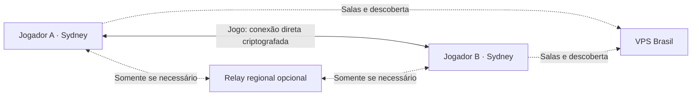

# Multiplayer P2P: Brasil apenas para salas e descoberta

O modo antigo entrega um único peer WireGuard por cliente: o VPS. `AllowedIPs`
inclui toda a sub-rede do jogo e o VPS encaminha os pacotes entre jogadores.
Portanto, com esse endpoint no Brasil, dois jogadores em Sydney passam pelo
Brasil. Isso é consequência da topologia; ajustar keepalive ou MTU não remove
esse caminho.

O novo modo usa **EasyTier 2.6.4 dentro do launcher**. Cada sala recebe nome de
rede aleatório, segredo próprio e endereços `10.77.0.x`. As salas podem reutilizar
a sub-rede porque são redes distintas. O serviço HTTP distribui essas credenciais
depois da verificação da senha e mantém a lista de participantes.



O `compose.mesh.yml` desabilita a retransmissão de dados no nó brasileiro com
`--relay-network-whitelist` vazio e permite somente RPC de descoberta com
`--relay-all-peer-rpc true`. Nenhum servidor WireGuard, interface TUN, encaminhamento
IP ou privilégio NET_ADMIN é necessário no VPS nesse modo.

EasyTier tenta conexões diretas entre os jogadores. Essa capacidade e a opção de
usar um nó exclusivamente para descoberta são descritas na documentação oficial:
[P2P](https://easytier.rs/en/guide/network/p2p-optimize.html) e
[shared nodes](https://easytier.rs/en/guide/network/host-public-server).

Cada cliente retransmite **apenas a rede da própria sala**
(`relay_network_whitelist = "of-room-<id>"`): nunca serve de relay público, mas
pode ser o caminho entre dois jogadores da sala dele que não fecham conexão
direta. Sem nenhuma rede na lista, o nó brasileiro continua sendo anunciado como
caminho — ele descarta os pacotes — e o par fica sem rota mesmo com um terceiro
jogador alcançável por ambos; medido em `scripts/test-vpn-mesh-fallback.py`.

Como o ponto de encontro é anunciado como rota mas não transporta dados, a coluna
de rota do launcher só chama de `Via relay` o caminho cujo próximo salto é outro
jogador. Um caminho que só passa pelo nó de descoberta aparece como
`Buscando conexão direta`, sem latência: a latência informada nesse caso é a
penalidade por salto do motor, não uma medição.

## Ativar no VPS

Estas alterações estão no repositório; não executam deploy automaticamente.

1. Distribua o launcher novo aos participantes. Clientes antigos recebem
   `launcher_update_required` ao tentar entrar/criar salas P2P.
2. Copie os arquivos desta pasta para o serviço no VPS. Preserve o diretório
   `data/` e o `.env` existente. Antes de trocar a stack, encerre as salas antigas
   WireGuard; elas não são convertidas em sessões EasyTier.
   Os jogadores também devem desconectar seus túneis WireGuard antigos; o novo
   cliente recusa iniciar se outra interface já usa `10.77.0.0/24`.
3. Configure no `.env`:

   ```dotenv
   VPN_ENABLE=true
   VPN_TRANSPORT=easytier
   VPN_MESH_PEERS=udp://191.252.212.22:11010,tcp://191.252.212.22:11010
   ```

   **O endereço precisa chegar ao VPS direto.** `vpn.mroz.dev.br` está atrás do
   Cloudflare, que encaminha apenas portas HTTP(S) e nenhuma UDP: anunciar esse
   nome em `VPN_MESH_PEERS` faria os clientes baterem na borda do Cloudflare na
   11010 e não encontrarem ninguém. Por isso o deploy usa o IP. Para não depender
   do IP, aponte um subdomínio **sem proxy** (nuvem cinza) para o VPS e use esse
   nome aqui; o valor é distribuído por sala pelo controlador, então trocar a
   variável basta.

4. Libere `11010/udp` e `11010/tcp` (`ufw allow 11010/tcp`, `ufw allow
   11010/udp`) e mantenha o proxy HTTPS existente para `127.0.0.1:8787`. O HTTPS
   atende às salas, não transporta os jogos.
   Se usar o Caddy do compose original, ele pode continuar apontando para
   `lan-controller:8787` pela rede Docker `lan-controller-net`, compartilhada
   com o novo compose. Não remova esse Caddy ao trocar o controlador.
5. Suba o controlador e o ponto de encontro:

   ```sh
   docker compose -f compose.mesh.yml up -d --build
   curl --fail https://vpn.mroz.dev.br/api/vpn/status
   ```

   A resposta deve conter `transport: "easytier"`, `topology: "mesh"` e
   `directConnections: true`. Isso informa o modo configurado; a coluna de rota
   no launcher confirma a conexão de cada jogador.

O compose P2P usa um controlador sem ferramentas WireGuard e mantém as rotas de
API. O mesmo serviço atende o OAuth do Google Drive do launcher: o Dockerfile P2P
não embute segredos, então o `compose.mesh.yml` monta o `google-oauth-secrets.mjs`
existente em `/app/google-oauth-secrets.mjs:ro`. Sem esse arquivo a API continua
de pé e apenas esse proxy se desliga. Não use o `deploy.sh` antigo para esta
migração: ele foi feito para ZeroTier e sobrescreve o `.env`.

Para manter um deploy WireGuard existente, continue usando seu compose atual.
O servidor ainda assume `VPN_TRANSPORT=wireguard` quando a variável está ausente.
O cliente novo negocia ambos os transportes.

## Redes que não permitem P2P

Proximidade geográfica não garante conectividade direta: CGNAT/NAT simétrico,
firewalls e bloqueios de UDP podem impedir a conexão. Com apenas o ponto de
encontro brasileiro, esses casos permanecem sem rota de jogo. O launcher mostra
`Buscando conexão direta` e explica a necessidade de um relay regional.

Para oferecer fallback, hospede outro nó EasyTier **fora do Brasil**, próximo aos
jogadores, permitindo retransmissão para `of-room-*`, e acrescente seus endpoints
a `VPN_MESH_PEERS`. Por exemplo, o processo do nó australiano pode usar:

```sh
easytier-core --no-tun true --network-name of-relay-au \
  --listeners udp://0.0.0.0:11010 tcp://0.0.0.0:11010 \
  --relay-network-whitelist 'of-room-*' --relay-all-peer-rpc true \
  --rpc-portal 127.0.0.1:15888
```

O endereço desse nó deve estar na lista distribuída aos clientes. Nenhum relay
terceirizado é adicionado automaticamente. O launcher diferencia `Conexão direta`
e `Via relay`, com a latência informada pelo motor. Essa latência é da rede
virtual, não uma medição de FPS nem necessariamente o ping exibido pelo jogo.

## Cliente, desempenho e ciclo de vida

- O runtime é distribuído com o launcher: `easytier-core`, `easytier-cli` e o
  driver Wintun no Windows. O fetch fixa versão/arquitetura e verifica SHA-256.
- A configuração é gerada localmente a partir de um esquema limitado; o
  controlador não pode fornecer flags arbitrárias. A única rota gerenciada é
  `10.77.0.0/24`; não há exit node nem substituição do DNS da máquina.
- A criação do adaptador requer autorização do sistema: pkexec no Linux e UAC no
  Windows. Um supervisor encerra o processo elevado ao desconectar ou se o
  launcher morrer. Desconectar não abre um segundo prompt de administrador.
- O heartbeat roda no processo principal a cada 15 segundos, com apenas uma
  consulta em andamento. Fechar a configuração ou trocar de aba não o interrompe.
- A interface consulta snapshots e restaura a sessão ao reabrir a configuração.
  A opção de conectar ao iniciar o jogo agora usa essa mesma sessão.
- Uma falha no HTTP/controlador não derruba o túnel P2P estabelecido. Novas salas
  e novas entradas ainda dependem da API; o sistema não é um diretório descentralizado.
- O servidor agrupa gravações de presença a cada 15 segundos e não regrava estado
  em consultas de leitura. No modo legado, inicialização WireGuard é compartilhada
  e o status não reconfigura a interface a cada consulta.

Os estados de sessão em memória não sobrevivem ao reinício completo do launcher;
é necessário entrar novamente na sala. A senha protege a distribuição inicial
das credenciais. Os membros de uma sala compartilham seu segredo de rede:
remover alguém da lista HTTP não revoga criptograficamente uma configuração já
copiada. Para revogar credenciais antigas, crie outra sala, com novo segredo.
O modelo atual é adequado a salas entre participantes convidados; expulsão forte
por membro exigiria credenciais individuais/rotação distribuída.

## Validação

```sh
npm run fetch:easytier
npm run test:vpn
npm run typecheck
python3 scripts/test-vpn-mesh-network.py
python3 scripts/test-vpn-mesh-fallback.py
```

Os testes de rede requerem Linux, user namespaces, `ip`, `nsenter`, `iptables` e
`ping`. Eles criam namespaces descartáveis e instâncias reais do gerenciador do
launcher; as interfaces e rotas da máquina hospedeira não são modificadas.

`test-vpn-mesh-network.py` verifica configuração aceita pelo EasyTier, tráfego IP
real via TUN, rota direta com relay desabilitado, continuidade após parar o ponto
de encontro e remoção dos adaptadores ao desconectar.

`test-vpn-mesh-fallback.py` bloqueia o caminho direto entre dois jogadores,
mantendo os dois com acesso ao ponto de encontro. Verifica que o nó de descoberta
não transporta o jogo nem quando é o único caminho, que o launcher informa isso
como `Buscando conexão direta` em vez de `Via relay`, e que um terceiro jogador
alcançável pelos dois — inclusive entrando depois — restabelece a sala.

O teste local não substitui validação entre duas conexões residenciais/CGNAT,
Windows com UAC/Wintun nem a descoberta LAN específica de cada jogo. Jogos podem
precisar de conexão por IP manual e regras de firewall do próprio jogo.

Upstream fixado: [release 2.6.4](https://github.com/EasyTier/EasyTier/releases/tag/v2.6.4).
